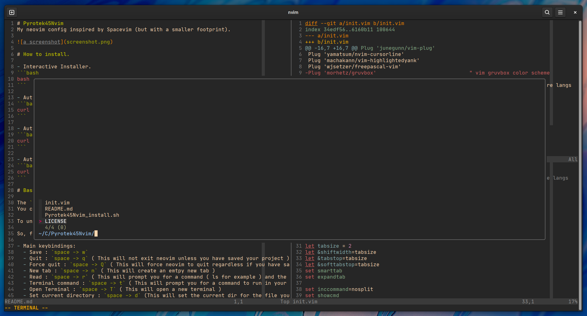

# Pyrotek45Nvim
My neovim config inspired by Spacevim (but with a smaller footprint).



# How to install.

- Interactive Installer.
```bash
bash -c "$(curl -fsLS https://raw.githubusercontent.com/pyrotek45/Pyrotek45Nvim/main/Pyrotek45Nvim_install.sh)"
```

- Automated Installer ( Normal )
```bash
curl https://raw.githubusercontent.com/pyrotek45/Pyrotek45Nvim/main/Pyrotek45Nvim_install.sh | bash -s 1
```

- Automated Installer ( Flatpak )
```bash
curl https://raw.githubusercontent.com/pyrotek45/Pyrotek45Nvim/main/Pyrotek45Nvim_install.sh | bash -s 2
```

- Automated Installer ( Both Normal and Flatpak )
```bash
curl https://raw.githubusercontent.com/pyrotek45/Pyrotek45Nvim/main/Pyrotek45Nvim_install.sh | bash -s 3
```

# Basic usage.

The `space` key is the leader for many of the added keybindings.
You can change the leader key in the init.vim file anytime.

To understand how to use the keybindings here, just remember `->` means followed. 

So, for example`space -> w` means pressing space (then letting go) and then quickly (within a second) pressing w.

- Main keybindings:
  - Save : `space -> w`
  - Quit : `space -> q` ( This will not exit neovim unless you have saved your project )
  - Force quit : `space -> Q` ( This will force neovim to quit regardless if you have saved your file or not )
  - New tab : `space -> n` ( This will create an emtpy new tab )
  - Read : `space -> r` ( This will prompt you for a command ( ls for example ) and the output of that command will be added to your text )
  - Terminal command : `space -> t` ( This will prompt you for a command to run in your terminal )
  - Open Terminal : `space -> T` ( This will open a new terminal )
  - Set current directory : `space -> d` (This will set the current dir for the file you have open ) 
  - Open file explorer : `space -> tab` ( This will open a new panel on the left with a file tree )
  - Open a file in a tab : `space -> e -> n` ( This will open a new tab and a browser to select a file to edit )
 
- Edit Keybindings:
  - Edit config : `space -> e -> c` ( This will open your neovim configuration )
  - Source config : `space -> s -> c` ( This will source your config to take immediate effect )
  
- Multi Cursor Mode:
  - Hover over a word and press : `ctrl + n` ( This will add a cursor to copies of the word ) 

- Window Movement:
  - Move left : `space -> h`
  - Move up : `space -> k`
  - Move down : `space -> j`
  - Move right : `space -> l`
  - Close all other windows : `space -> o`

- Splits and Tabs:
  - Open vertical split : `space -> s -> v`
  - Open horizontal split : `space -> s -> h`
  - Move to the left tab : `space -> (`
  - Move to the right tab : `space -> )`
  - Close all other tabs : `space -> c `

- Table:
  - In visual mode press : `space -> t` : ( This will take the currently highlighted lines and run them through column )

- Indenting:
  - In visual mode press : `space -> l` : ( This will indent the currently highlighted lines and indent them together to the right )
  - In visual mode press : `space -> h` : ( This will indent the currently highlighted lines and indent them together to the left )

- Normal Mode:
  - In visual mode press : `space -> n` : ( This will enter you in normal mode where your commands will affect every highlighted line ) 

- Fuzzy Finder:
  - Activate the fuzzy finder in the current folder : `space -> f`
  - Activate the fuzzy finder in the home folder : `space -> F`

- Git Tools:
  - Git diff : `space -> g -> d`
  - Git blame : `space -> g -> b`
  - Git status : `space -> g -> s`

